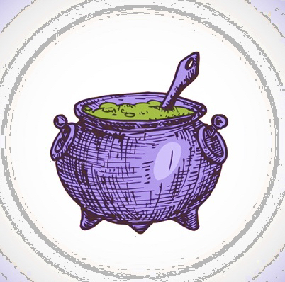

# HOMEBREW

> Dungeons and Dragons community app
> A link to the project website is [_here_](https://radiant-thicket-52137.herokuapp.com/).

## Table of contents

- [General info](#general-info)
- [Technologies](#technologies)
- [Installation](#installation)
- [Instructions](#instructions)
- [Features](#features)
- [Screenshots](#screenshots)
- [Usage](#usage)
- [Project Status](#project-status)
- [Room for Improvement](#room-for-improvement)
- [Acknowledgements](#acknowledgements)
- [Contacts](#contact)

## General Info



We have created an all in one Dungeons and Dragons application where users can create an account, create and save their own character builds, see and comment on other users’ characters, and receive feedback on their own builds! We hope that HOMEBREW will allow players to show off their creativity and find inspiration while building a community.

## Technologies

Project is created with:

- Node
- React
- Apollo
- JavaScript
- CSS
- Graphql
- MongoDB

## Installation

To open this project in vscode using git in Terminal/Git Bash:

```
cd in directory there you want to store your project
git clone https://github.com/elfsvet/homebrew.git
code .
```

## Instructions

Just open the [link](https://radiant-thicket-52137.herokuapp.com/) and do your stuff.

## Features

- Bootswatch
- React-bootstrap
- Concurrently
- Jwt
- Mongoose
- Express
- Faker

## Screenshots


## Usage

Create your personal characters and enjoy other builds of your favorite races and classes.

## Project Status

Project is: _complete_

## Room for Improvement

To do:

- Upload photos to use as profile pictures and character art.
- Upvote feature on builds and allow search filter by popularity.
- Allow users to save other users’ characters for future reference.
- Virtual roll dice animation feature.
- Add additional levels to characters to allow for feats and max builds.
- Add an info snippet when users hover over classes, races, stats, etc.
- Add a donate page to support the dev team :)


## Acknowledgements

- This project was inspired by UM Coding Boot Camp
- This project was created from module code + extra effort + [Redux tutorial](https://redux.js.org/tutorials/fundamentals/part-1-overview)

## Contact

> If you still have any questions, please don't hesitate to contact me:
> Created by:

- [@Abstrack5](https://github.com/Abstrack5) || [LinkedIn](https://www.linkedin.com/in/armon-ahmadi)

- [@justjulio95](https://github.com/justjulio95) || [LinkedIn](https://www.linkedin.com/in/julio-suarez95/)

- [@yoli19](https://github.com/yoli19) || [LinkedIn](https://www.linkedin.com/in/yolanda-jacobs-a477a5153/)

- [@elfsvet](https://github.com/elfsvet) || [LinkedIn](https://www.linkedin.com/in/stepanmatysik/)